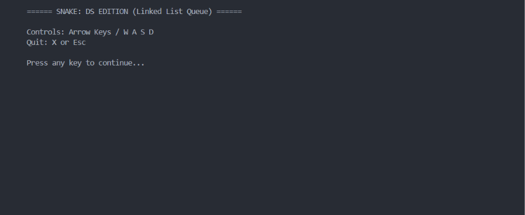
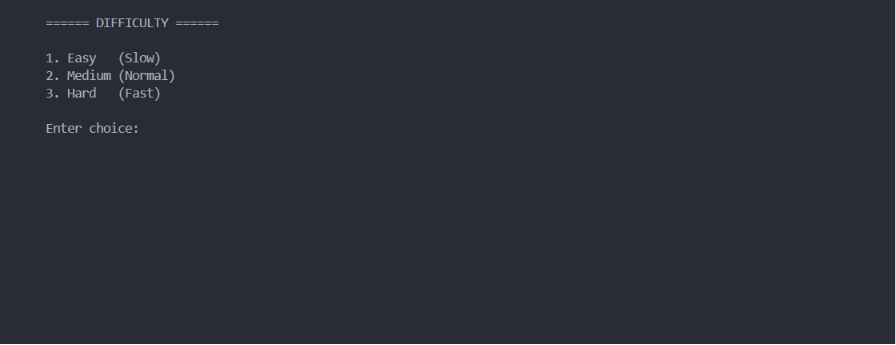
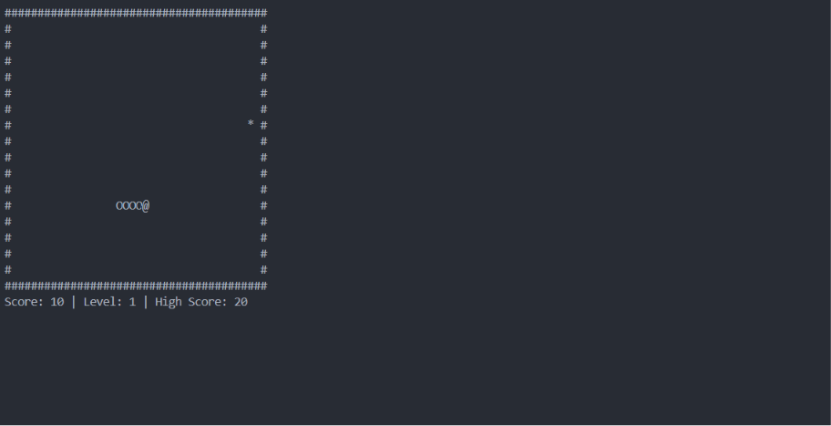
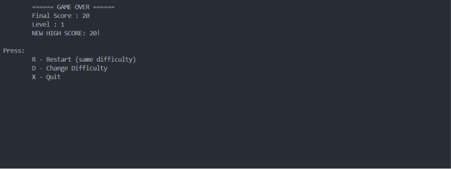

# Snake Game — Data Structures Edition

A console-based Snake Game developed in **C** that demonstrates the implementation of a **Queue using a Doubly Linked List**. The project combines classic Snake gameplay with Data Structures concepts, including dynamic memory allocation and linked list operations.

---

## Project Overview

This project implements the classic Snake Game while showcasing the practical application of a **Queue using a Doubly Linked List**. The snake grows dynamically as it consumes food, with its body managed efficiently through linked list operations.

The game also includes multiple difficulty levels, obstacles, bonus food, level progression, and persistent high score tracking.

---

## Features

- Queue implementation using a Doubly Linked List
- Dynamic snake growth
- Three difficulty levels (Easy, Medium, Hard)
- Automatic level progression
- Increasing game speed with higher levels
- Random obstacle generation
- Bonus food with timer
- High score saved in `highscore.txt`
- Restart game without exiting
- Change difficulty after Game Over
- Real-time keyboard controls

---

## Technologies Used

- C Programming
- Data Structures (Queue using Doubly Linked List)
- Windows Console API
- GCC / MinGW

---

## Project Structure

```
Snake-Game-DS/
│
├── snake_linkedlist.c
├── highscore.txt
├── screenshots/
│   ├── intro.png
│   ├── gameplay.png
│   ├── gameover.png
│   └── difficulty.png
├── README.md
└── .gitignore
```

---

## Controls

| Key     | Action     |
| ------- | ---------- |
| ↑ / W   | Move Up    |
| ↓ / S   | Move Down  |
| ← / A   | Move Left  |
| → / D   | Move Right |
| X / Esc | Quit Game  |

---

## Scoring

| Item              | Points |
| ----------------- | ------ |
| Normal Food (`*`) | +10    |
| Bonus Food (`$`)  | +50    |

---

## Game Features

- Snake grows whenever food is collected.
- Speed increases as the level increases.
- Obstacles appear in higher levels.
- Bonus food disappears after a limited time.
- Collision with walls, obstacles, or the snake's own body ends the game.
- Highest score is automatically stored and loaded.

---

## How to Run

### Compile

```bash
gcc snake_linkedlist.c -o snake.exe
```

### Run

```bash
snake.exe
```

---

## Screenshots

### Intro Screen



### Difficulty Selection



### Gameplay



### Game Over Screen



---

## Concepts Demonstrated

- Queue Data Structure
- Doubly Linked List
- Dynamic Memory Allocation
- File Handling
- Console Graphics
- Keyboard Event Handling
- Game Loop Design

---

## Author

**Riya Dodiya**

B.Tech – Artificial Intelligence & Machine Learning

---

## License

This project is developed for educational and academic purposes.
